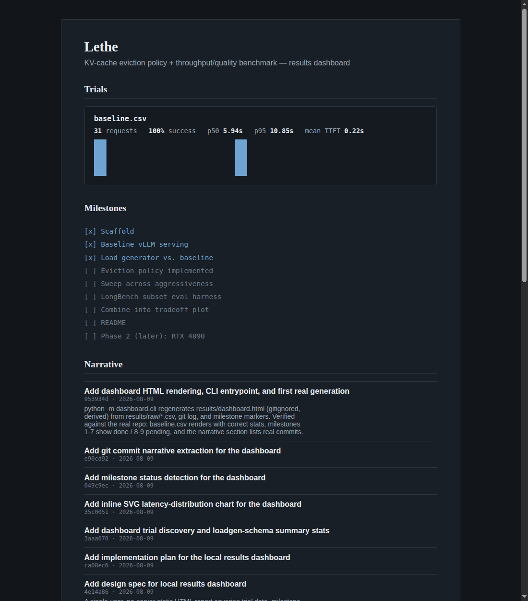

# Lethe

KV-cache eviction policy + throughput/quality benchmark for LLM serving.

## Problem

Long-context LLM serving is memory-bound: the KV cache grows linearly with
context length and batch size. Eviction/compression methods (StreamingLLM,
H2O, etc.) are usually benchmarked on perplexity alone, in isolation from a
real serving stack. Almost no public work shows the actual **tokens/sec vs.
quality-loss curve** under realistic concurrent load — which is what a
practitioner actually needs to decide whether to adopt a technique.

Lethe builds one eviction policy, integrates it into a real serving stack
(vLLM), and produces that curve honestly, on real (constrained) consumer
hardware — not a novel algorithm, but an honest end-to-end measurement of
an existing one.

The full design rationale, including the hardware- and software-driven
pivots along the way, lives in
[`docs/superpowers/specs/2026-08-09-kv-cache-eviction-benchmark-design.md`](docs/superpowers/specs/2026-08-09-kv-cache-eviction-benchmark-design.md).

## Method

- **Eviction policy:** StreamingLLM-style — protect N sink tokens + a
  sliding recent window, evict the middle. Aggressiveness = window size.
  Chosen over H2O because H2O requires materializing attention scores,
  which is incompatible with the fused attention kernels vLLM needs for
  realistic throughput.
- **Load generator:** async Poisson-arrival client against vLLM's
  OpenAI-compatible API, sweeping request rate, context-length mix, and
  eviction aggressiveness, recording per-request latency/TTFT/success to
  CSV.
- **Config-driven:** model and hardware definitions live in
  `configs/models/*.yaml` and `configs/hardware/*.yaml` — no model or GPU
  assumptions are hardcoded into `serving/` or `loadgen/`, so adding a
  second model or machine (see Limitations) means adding a config file,
  not touching code.

## Hardware & Models

- **GPU:** NVIDIA GeForce RTX 5070 Laptop, 8GB VRAM — a live desktop
  session shares this GPU, so available VRAM fluctuates between runs.
- **Model:** [Qwen3-4B-Instruct-2507](https://huggingface.co/Qwen/Qwen3-4B-Instruct-2507),
  AWQ 4-bit, community quant
  [`cpatonn/Qwen3-4B-Instruct-2507-AWQ-4bit`](https://huggingface.co/cpatonn/Qwen3-4B-Instruct-2507-AWQ-4bit).
- **Serving:** vLLM 0.26.0. `--quantization` is not forced (vLLM
  auto-detects it from the checkpoint); `gpu_memory_utilization=0.75` and
  `max_model_len=6000` were tuned down from more ambitious starting values
  after hitting real CUDA OOM and KV-cache-budget errors on this GPU —
  see the commit history for the exact numbers hit at each setting.
- **Known environment quirk:** FlashInfer's JIT-compiled top-k/top-p
  sampling kernel fails to build on this CUDA-13.3 + sm_120 (Blackwell)
  combination; `serving/server.py` sets `VLLM_USE_FLASHINFER_SAMPLER=0` to
  fall back to vLLM's PyTorch-native sampler instead.

## Status

Milestones 1-3 (scaffold, baseline vLLM serving, load generator) are done,
plus a local results dashboard for tracking everything as it lands.
Milestones 4-7 (eviction policy, aggressiveness sweep, LongBench eval,
tradeoff plot) are not yet built — the "Results" section below reflects
that honestly.



Regenerate it any time with:

```bash
.venv/bin/python -m dashboard.cli
```

then open `results/dashboard.html` in a browser (fully offline, no server
needed).

## Reproducing

```bash
# from the repo root
python3 -m venv .venv
.venv/bin/pip install -r requirements.txt

# confirm the GPU + installed vLLM actually work together
.venv/bin/python serving/verify_gpu.py

# launch the config-driven vLLM server (first run downloads ~2.5GB and
# takes several minutes to compile CUDA graphs; subsequent runs are fast)
.venv/bin/python -m serving.server \
  --model-config configs/models/qwen3-4b-instruct-2507-awq.yaml \
  --hardware-config configs/hardware/rtx5070-laptop.yaml

# in a second terminal, once the server logs "Application startup complete"
.venv/bin/python serving/smoke_test.py

# run a load sweep against it
.venv/bin/python -m loadgen.cli \
  --model-config configs/models/qwen3-4b-instruct-2507-awq.yaml \
  --rate 1.0 --duration 30 \
  --eviction-aggressiveness baseline --slo-latency-sec 5.0 \
  --out results/raw/my_run.csv

# regenerate the results dashboard
.venv/bin/python -m dashboard.cli

# run the automated test suite
.venv/bin/pytest -v
```

## Results

`results/raw/baseline.csv` — the first real, sanity-checked run against the
live server, no eviction policy active (31 requests, rate=1/s over 30s):

| metric | value |
|---|---|
| success rate | 100% |
| p50 latency | 5.94s |
| p95 latency | 10.85s |
| mean TTFT | 0.22s |
| context length range | 184-3753 tokens |

_Filled in at milestone 7-8 — the core deliverable (throughput vs.
quality-degradation across eviction aggressiveness settings) needs the
eviction policy, aggressiveness sweep, and LongBench eval, none of which
are built yet._

## Limitations

- **Single consumer GPU**, shared with a live desktop session — available
  VRAM is not perfectly stable across runs; this is disclosed, not hidden.
  It's directly why `max_model_len` and `gpu_memory_utilization` ended up
  more conservative than originally planned (see commit history).
- **Eviction policy is position-based** (StreamingLLM-style), not
  content-aware — expected to break down on tasks requiring precise recall
  of specific early-context details that aren't near a sink or the recent
  window. That's the expected, honest failure mode to report on once
  milestone 6 (LongBench eval) lands, not a bug to fix.
- **Model/hardware coverage starts at one pair** (Qwen3-4B x RTX 5070
  Laptop). A second machine (RTX 4090, 24GB) and model are planned as
  milestone 9, reusing the same config-driven code — not built yet.
