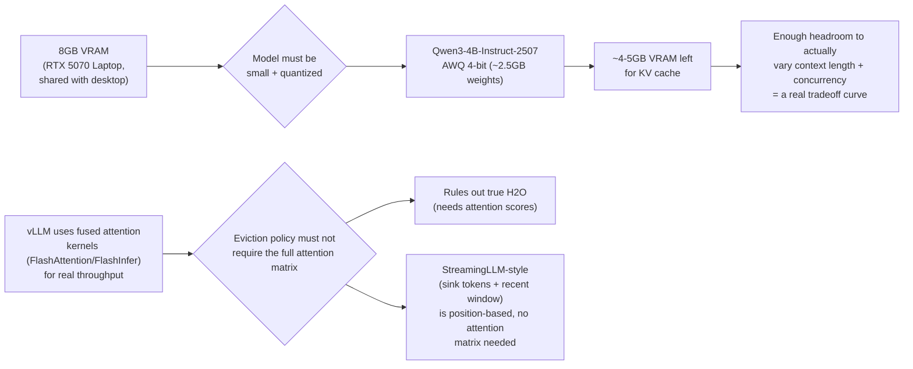
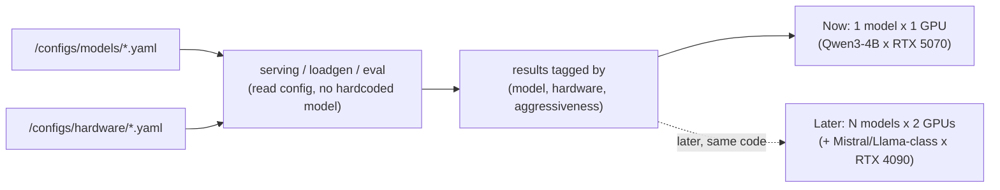
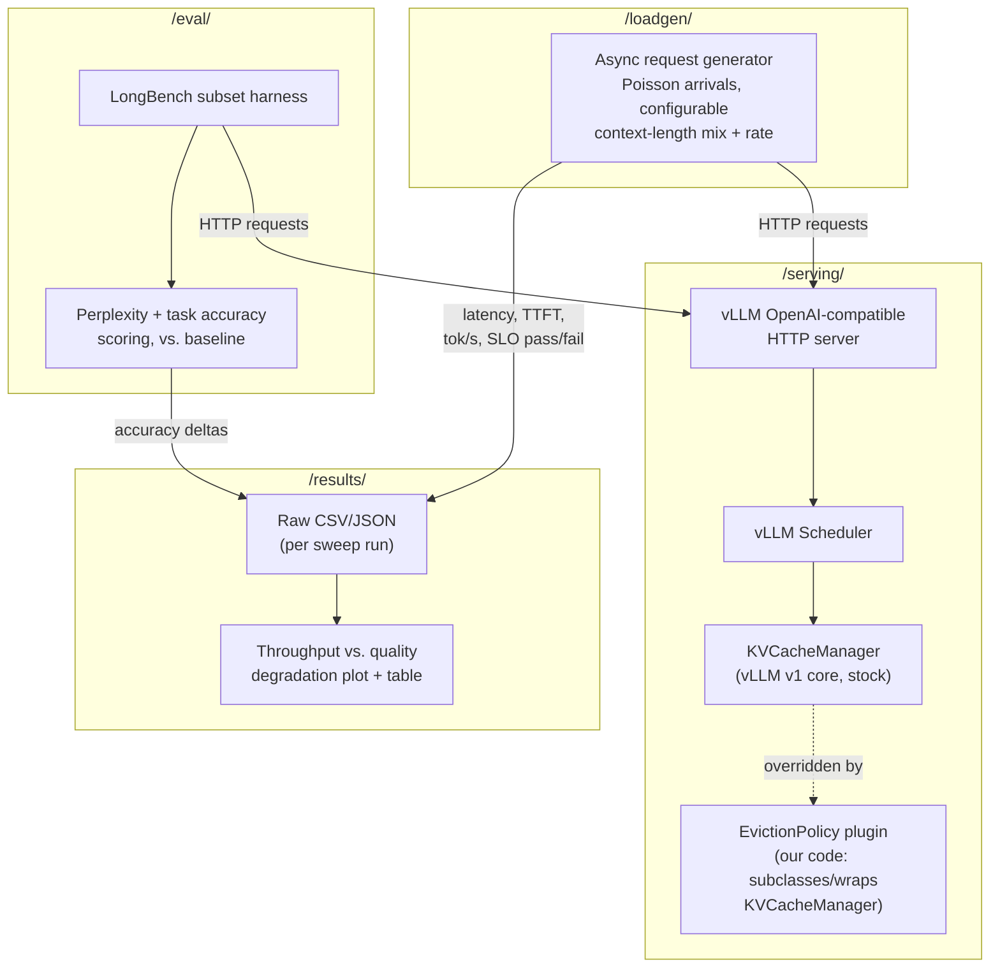
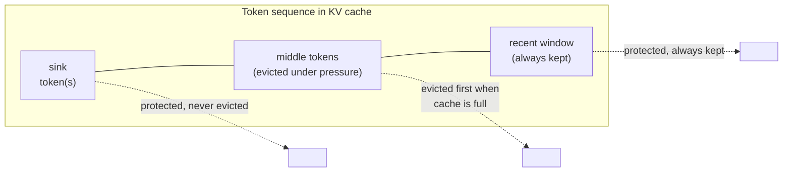
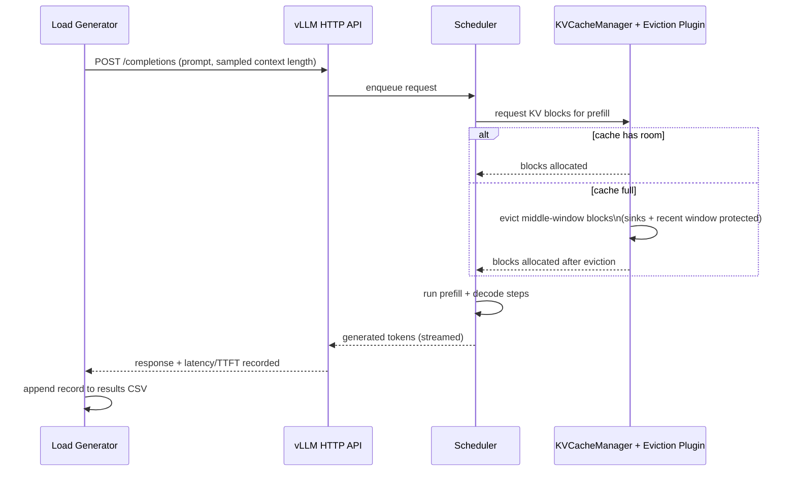
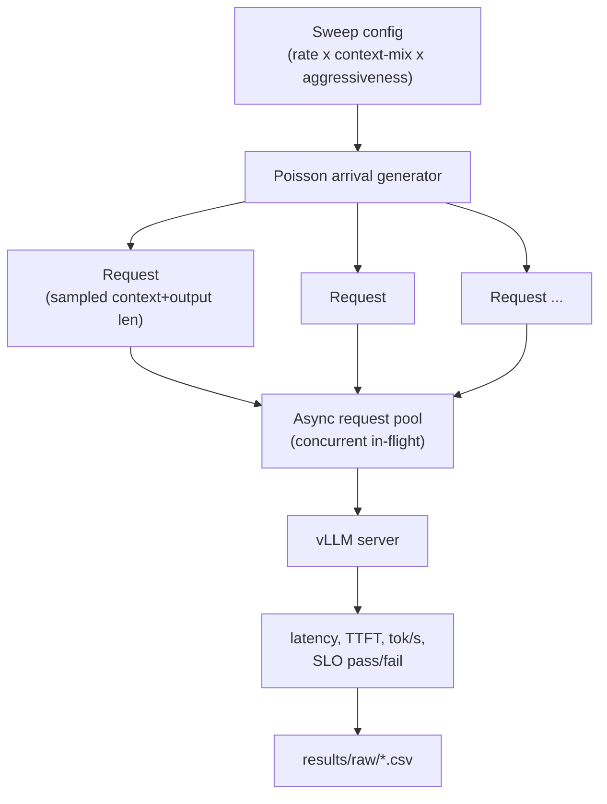
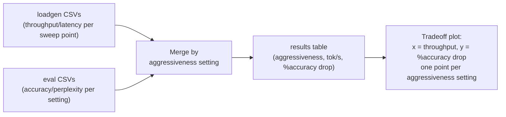
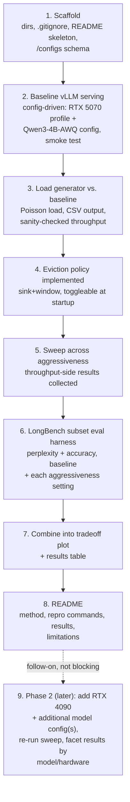

# Design: KV-Cache Eviction Policy + Throughput/Quality Benchmark

**Date:** 2026-08-09
**Status:** Draft — pending review

## 1. Problem

Long-context LLM serving is memory-bound: the KV cache grows linearly with context
length and batch size. Eviction/compression methods (StreamingLLM, H2O, etc.) are
usually benchmarked on perplexity alone, in isolation from a real serving stack.
Almost no public work shows the actual **tokens/sec vs. quality-loss curve** under
realistic concurrent load — which is what a practitioner actually needs to decide
whether to adopt a technique.

This project builds one eviction policy, integrates it into a real serving stack
(vLLM), and produces that curve honestly, on real (constrained) consumer hardware.

**Explicit non-goal:** a novel eviction algorithm. Implementing an existing method
correctly and benchmarking it honestly is the contribution.

## 2. Environment constraints that shaped this design



Two decisions fell directly out of hardware/software reality, not preference:

- **Model:** dropped from the original "7-8B" scope to **Qwen3-4B-Instruct-2507
  (AWQ)** — a 7-8B model, even quantized, would leave too little VRAM for the KV
  cache to vary meaningfully, starving the exact axis (context × concurrency) the
  project needs to produce a real curve.
- **Eviction policy:** dropped from the original "H2O" pick to **StreamingLLM-style
  (attention sinks + recent window)** — true H2O requires materializing attention
  scores per token, which is incompatible with the fused attention kernels vLLM
  needs for realistic throughput. vLLM's own (open, unmerged) feature request for a
  pluggable eviction interface — [vllm-project/vllm#36311](https://github.com/vllm-project/vllm/issues/36311)
  — uses attention-sink protection as its reference implementation for exactly this
  reason.

## 3. Model & hardware modularity

The goal is as much benchmark data as possible, not one model on one machine.
Today's environment is the RTX 5070 (8GB) laptop; a second machine with an RTX
4090 (24GB) becomes available once the tool is working end-to-end there. Rather
than hardcode a model name/quantization/GPU assumption into `/serving/`,
`/loadgen/`, and `/eval/`, both are pulled from small config files, and every
result row is tagged with which (model, hardware) combination produced it.

```
/configs/models/qwen3-4b-instruct-2507-awq.yaml
    hf_repo: Qwen/Qwen3-4B-Instruct-2507   (AWQ variant)
    quantization: awq
    native_context_length: 262144

/configs/hardware/rtx5070-laptop.yaml
    gpu_name: RTX 5070 Laptop
    vram_gb: 8
```

Adding a model or a machine later — e.g. `mistral-7b-instruct-awq.yaml` +
`rtx4090.yaml` once that box is available — means adding a config file, not
touching serving/loadgen/eval code. `/results/` keys every row by
`(model, hardware, eviction_aggressiveness)`, so the same plotting code that
produces the primary throughput-vs-quality curve can also facet by model or
hardware once more than one of each exists.



**Scope for the implementation plan below:** build and validate the config-driven
tool against today's single (model, hardware) pair. Extending the model/hardware
config set to the 4090 is a distinct follow-on phase (§10, milestone 9) — not
blocked on any redesign, since the config abstraction is what milestones 1-8
are built against from the start.

## 4. System architecture



The eviction plugin lives entirely in our `/serving/` package. It is "pluggable" in
the sense of being our own swappable code, toggled at server startup (not an
official vLLM extension point — none is merged yet). This is documented explicitly
in the README, per the "document clearly anywhere you must patch internals"
requirement.

## 5. Eviction policy: StreamingLLM-style



- **Sink tokens:** first N tokens of the sequence, protected from eviction (they
  absorb a disproportionate share of attention mass in pre-norm transformers like
  Qwen).
- **Recent window:** the most recent W tokens, always kept.
- **Middle:** everything else — evicted first when the cache is under pressure.
- **Aggressiveness knob:** window size W. Smaller W = more aggressive eviction =
  more throughput/memory headroom, more expected quality loss. This is the
  independent variable swept across the tradeoff curve.

## 6. Request flow (single request, sequence diagram)



## 7. Load generator design (`/loadgen/`)

- Async Python client (`httpx`/`asyncio`) against vLLM's OpenAI-compatible API.
- **Arrivals:** Poisson process, configurable rate (λ) — drives concurrency.
- **Per-request sampling:** context length drawn from a configurable
  short/medium/long bucket distribution; output length similarly configurable.
- **Sweep dimensions:** arrival rate, context-length mix, eviction aggressiveness
  (including a "disabled" run = baseline).
- **Per-request metrics recorded:** latency, time-to-first-token, tokens/sec,
  success vs. timeout against a fixed latency SLO.
- **Output:** CSV, one row per request, tagged with the sweep parameters that
  produced it.



## 8. Quality evaluation (`/eval/`)

- **Benchmark:** LongBench, subset selection justified by (a) fitting within our
  configured max sequence length given the 8GB budget, and (b) spanning task types
  — single-doc QA, multi-doc QA, summarization — rather than one category.
- **Metrics:** perplexity **and** LongBench's native task-level scoring (F1/ROUGE/
  accuracy depending on task), both reported — perplexity alone can look fine while
  task accuracy degrades, especially for eviction policies that drop early-context
  detail.
- Run once per eviction aggressiveness setting (including baseline), diffed against
  baseline to produce "% accuracy drop."

## 9. Results (`/results/`)



Raw CSV/JSON per run is kept under `/results/raw/`; the plotting script is
deterministic and re-runnable from those files alone (no need to re-run the
benchmark to regenerate the plot).

## 10. Repository structure

```
/serving/        - vLLM integration + eviction policy plugin
/loadgen/        - concurrent request load generator
/eval/           - LongBench harness + accuracy scoring
/results/        - raw benchmark output (CSV/JSON) + plots
/configs/models/ - one YAML per model (hf repo, quantization, context length)
/configs/hardware/ - one YAML per machine (GPU name, VRAM budget)
/docs/           - specs and design docs (this file lives here)
/README.md       - problem statement, method, reproducible instructions, results
/.gitignore      - excludes model weights, checkpoints, logs, venvs
```

## 11. Milestone plan (each an independent, committable step)



Each milestone is a real commit — no dumping everything as one commit. Milestones
1-8 are this implementation plan's scope: build and validate the config-driven
tool on the hardware in hand (RTX 5070, Qwen3-4B). Milestone 9 — bringing in the
RTX 4090 and additional model configs for more data points — starts once 1-8 are
done and the tool is proven to work; it reuses the same code, adding config files
rather than redesigning anything (§3).

## 12. Known risks / open technical items (not decisions — spikes for milestone 2)

- vLLM's own CUDA kernels (FlashInfer, quantization kernels) for sm_120
  (Blackwell) have been catching up through 2026; may need a recent vLLM release
  or minor build workarounds. PyTorch itself already supports sm_120 natively in
  this environment (2.12+cu130).
- Exact `KVCacheManager` class/method names to override are pinned once vLLM is
  installed and its source inspected for the version we land on.
- LongBench task subset finalized once max sequence length is confirmed against
  actual available KV-cache budget on this GPU.

## 13. Limitations to carry into the README (known up front)

- Single consumer GPU for the milestone 1-8 results, shared with a desktop
  session — available VRAM is not perfectly stable across runs; this is
  disclosed, not hidden. (Addressed for a second data point in milestone 9.)
- Eviction policy is position-based (StreamingLLM-style), not content-aware —
  expected to break down on tasks requiring precise recall of specific early-
  context details that aren't near a sink or the recent window. This is the
  expected, honest failure mode to report on, not a bug to fix.
- Model/hardware coverage starts at one pair (Qwen3-4B x RTX 5070); breadth
  comes from milestone 9 onward, not from this initial pass.
